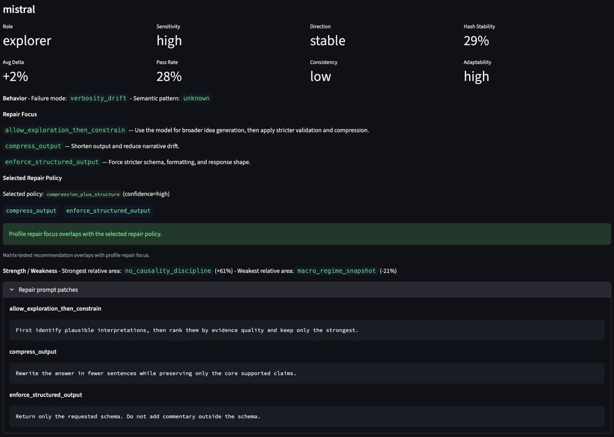

# ai-evaluation-harness

A reproducible evaluation harness for studying LLM behavior through controlled prompt suites, repeated runs, and structured interpretation — including claim extraction, narrative synthesis, and audit-based validation — designed for systematic local-model experimentation.

## Conceptual framing

This project is currently focused on **behavioral interpretability**.

Mechanistic interpretability asks what internal model structures produced a behavior. This project begins one layer outward: what stable behaviors can be observed, classified, measured, repaired, and eventually related back to deeper internal structure?

The working progression is:

```text
claims
  → audits
  → repairs
  → telemetry
  → model profiles
  → uncertainty signatures
  → token-level diagnostics
  → possible mechanistic probes
  ```

## v1.0 milestone

This repository’s v1.0 milestone establishes the core behavioral harness:

- modular YAML prompt suites
- reusable runner configs for controlled inference sweeps
- multi-rep runs for distributional measurement
- aggregated benchmark outputs via `runs_master`
- Streamlit dashboard analytics, including:
  - prompt × model summaries
  - pass-rate heatmaps
  - within-suite experiment comparison tables
  - signed delta heatmaps

This version focuses on the **measurement layer**: running controlled prompt suites, aggregating outputs, and visualizing model behavior across repeated local runs.
Later versions extend this toward narrative generation, validation, and richer telemetry.

## v1.4 milestone

The v1.4 system extends the behavioral harness into a structured evaluation and validation pipeline:

- claim generation from benchmark deltas
- claim selection and normalization
- narrative synthesis grounded in validated claims
- strict claim-reference constraints ([CLAIMS: ...])
- narrative parsing and traceability mapping
- audit system for evaluating:
  - claim coverage
  - trace-supported vs heuristic-supported statements
  - overlap fidelity between narrative and source claims
- repair loop for improving narrative fidelity
- run-scoped experiment tracking under `benchmarks/results/runs/*`
- expanded dashboard including:
  - audit analytics
  - narrative traceability
  - claim coverage diagnostics
- explicit narrative-to-claim traceability and coverage tracking

This version focuses on **closing the loop between measurement → interpretation → validation**.

## v1.5 milestone (current)

The v1.5 system extends the harness from structured macro evaluation into a **behavioral interpretability and repair-policy layer**.

This version moves beyond measuring whether a model passes or fails a prompt. It begins to characterize *how* models fail, whether those failures recur, which repair strategies improve outputs, and how those repair recommendations can be persisted as reusable pipeline artifacts.

Core additions include:

- FRED-integrated macro prompt suite
- structured macro validation via check-based and JSON-constrained tasks
- failure-mode taxonomy for schema, semantic, symbolic, verbosity, and narrative failures
- semantic pattern classification for structured selection errors
- prompt-level experiment comparison across temperature regimes
- model behavior summaries with:
  - pass rates
  - dominant failure modes
  - response hash stability
  - sentence/word telemetry
- model profile artifacts:
  - `model_profile_summary.csv`
  - `model_profile_summary.json`
- repair matrix evaluation:
  - strategy-aware repair runs
  - repair success scoring
  - coverage and audit deltas
  - selected matrix-tested repair recommendation
- repair policy artifacts:
  - `repair_strategy_recommendation.json`
  - `repair_policy_recommendations.csv`
  - `repair_policy_recommendations.json`
- dashboard integration for:
  - model profile cards
  - repair focus
  - selected repair policy
  - profile/policy overlap
  - repair prompt patches

This version focuses on **behavioral interpretability**: mapping stable model failure signatures across tasks, temperatures, prompt types, and repair strategies.

## Example dashboard output

<p align="center">
  
</p>

Sample v1.5 model profile card showing behavioral role, repair focus, selected repair policy, and strategy-specific prompt patches.

## Key findings (v1.5)

v1.5 suggests that model behavior can be usefully analyzed as a set of stable, task-dependent failure regimes rather than as isolated prompt failures.

- **Failure modes are structured and repeatable**
  - model failures cluster by task type
  - structured tasks often fail through semantic or selection errors
  - freeform tasks often fail through verbosity or narrative drift
  - repeated runs reveal stable behavioral signatures rather than purely random noise

- **Model differences are qualitative, not only quantitative**
  - models differ not just in pass rate, but in *how* they fail
  - some models act as stable anchors
  - some models show drifting capacity under temperature changes
  - some models behave more like explorers, improving on some prompts while degrading on others

- **Prompt-level deltas matter**
  - suite-level averages can hide important behavioral variation
  - prompt-level comparison surfaces best/worst prompt regimes
  - this enables model profiles that distinguish stability, adaptability, and temperature sensitivity

- **Repair can be evaluated rather than guessed**
  - repair strategies can be run as controlled experiments
  - repair outputs can be audited before/after
  - repair success can be scored using claim coverage, missing references, unknown claim IDs, and audit flags
  - selected repair policies can be written as durable artifacts for downstream use

- **Dashboard outputs are becoming control-room artifacts**
  - model profile cards summarize behavioral role, sensitivity, direction, consistency, adaptability, and repair focus
  - repair policy recommendations show which tested strategy currently aligns with each model profile
  - the dashboard increasingly reads from pipeline artifacts rather than recomputing interpretive logic inline

These results frame the harness as a practical system for **behavioral interpretability**: observing, classifying, repairing, and tracking model failure signatures before attempting deeper token-level or mechanistic analysis.

## Current artifact pipeline

The current v1.5 pipeline produces durable artifacts that can be inspected directly or consumed by the dashboard:

```text
raw benchmark runs
  → runs_master.csv / runs_master.parquet
  → model behavior summaries
  → prompt-level model deltas
  → model_profile_summary.csv/json
  → repair matrix evaluations
  → repair_matrix_summary.csv/json
  → repair_strategy_recommendation.json
  → repair_policy_recommendations.csv/json
  → dashboard profile cards and repair-policy views
```

The dashboard increasingly acts as a read-only control room over these artifacts rather than as the primary source of interpretive logic.

## Why this exists

The goal of this project is to build a practical local-model evaluation lab for studying LLM behavior from the outside inward.

The harness is designed to measure:

- reliability across prompt types
- behavioral drift under inference changes
- temperature-sensitive tradeoffs across structure, style, verbosity, and attention
- stable model-specific failure signatures
- claim and narrative fidelity
- repair effectiveness across strategy types
- foundations for later token-level and mechanistic interpretability work

Temperature is treated here not just as “randomness,” but as a behavioral control knob that can shift model performance across competing dimensions.

The project’s current focus is **behavioral interpretability**: not identifying which internal neurons caused a behavior, but building a reproducible map of what stable failure signatures a model exhibits under specific tasks, data regimes, temperatures, and repair strategies.

## How this can be used

From a risk perspective, this harness maps how model behavior shifts under controlled inference changes, similar to stress testing a system across regimes.

A model can be treated as having behavioral exposures:

- prompt-type exposure
- temperature sensitivity
- schema reliability
- verbosity drift
- semantic selection bias
- claim-reference reliability
- repair responsiveness

By running repeated evaluations across prompt types, temperatures, and models, the harness surfaces behavioral tradeoffs explicitly. This can inform:

- model selection
- prompt design
- repair strategy selection
- guardrail design
- human review workflows
- model risk reporting

In practice, the harness aims to make model reliability measurable, explainable, repairable, and auditable rather than anecdotal.

## Repository layout

```
benchmarks/
  Prompt suites, runners, aggregation, claim/narrative/audit/repair scripts,
  model profile builders, and repair policy artifact generation

dashboards/
  Streamlit dashboard for run analytics, model profiles, repair matrix summaries,
  narrative audit views, and repair-policy inspection

docs/
  Research notes, roadmap documents, project logs, images, and schema notes

experiments/
  Scratch / future experimental work
```

## Quick start

1. Create the environment
```bash
conda env create -f environment.yml
conda activate ai-lab
```

2. Run a benchmark suite
From the repository root:
```bash
cd benchmarks
python run_suite.py --suite suite_instruction.yml --runner runner_temp0.yml
```

3. Aggregate outputs
```bash
python aggregate_runs.py
```
This produces the aggregated `runs_master` artifacts used by the dashboard and later analysis steps.

4. Launch the dashboard
From the repository root:
```bash
streamlit run dashboards/eval_dashboard.py
```

## Dashboard preview

### Prompt × model pass-rate heatmap
<p align="center">
  
</p>
Pass-rate heatmap across prompt × model combinations, showing constraint-specific degradation patterns across temperature sweeps.

### Within-suite experiment comparison
<p align="center">
  
</p>

## Example early findings

Across repeated temperature sweeps on the initial suites, the harness has already surfaced several stable patterns:

- some structural output constraints are largely temperature-insensitive
- some instruction-following failures appear saturated across all tested temperatures
- style and verbosity constraints can move in opposite directions as temperature rises
- some attention constraints remain stable at low temperature and degrade only at higher temperature

These are early behavioral results rather than final scientific claims, but they demonstrate that the harness can detect real tradeoff surfaces in model behavior.

## Version roadmap

- **v1.0 — Behavioral harness**
  - modular YAML suites
  - repeated local-model runs
  - aggregated `runs_master`
  - dashboard pass-rate and delta analysis

- **v1.2–v1.4 — Claim, narrative, and audit layer**
  - claim extraction and normalization
  - narrative generation with strict grounding constraints
  - `[CLAIMS: ...]` reference discipline
  - parsing, audit, traceability, and repair loops

- **v1.5 — Behavioral interpretability and repair-policy layer**
  - FRED-integrated macro evaluation
  - failure taxonomy and semantic pattern classification
  - prompt-level model delta summaries
  - model profile cards and durable profile artifacts
  - repair matrix evaluation and scoring
  - repair strategy recommendations
  - per-model repair policy artifacts
  - dashboard control-room integration

- **v1.6 — FRED-native claim/evidence layer**
  - macro-native claim schema
  - FRED/CPI evidence objects
  - structured claim IDs tied to source series, prompt, model, and experiment
  - CPI-oriented claim generation and selection
  - narrative generation from macro-native claims

- **v1.7 — CPI demo loop**
  - data → claim → narrative → audit → repair → re-audit
  - repair-policy-driven narrative improvement
  - dashboard traceability from final narrative back to source evidence

- **v2.0 — Token/probabilistic telemetry**
  - token probabilities / logprobs where available
  - entropy and uncertainty signatures
  - token-level diagnostics around numbers, citations, and unsupported claims
  - behavioral confidence signals before audit failure

- **v3.0 — Early mechanistic probing**
  - hidden states / activations on open models
  - attention and residual-stream inspection
  - activation patching or ablation experiments
  - sparse-feature or circuit-style probes informed by prior behavioral maps

## Notes

Generated benchmark artifacts can become large quickly. The public repository is intended to keep the core framework, selected examples, and documentation clean, while broader local result corpora remain excluded from version control unless explicitly curated.

## License

Currently unlicensed / all rights reserved unless and until a license is added.