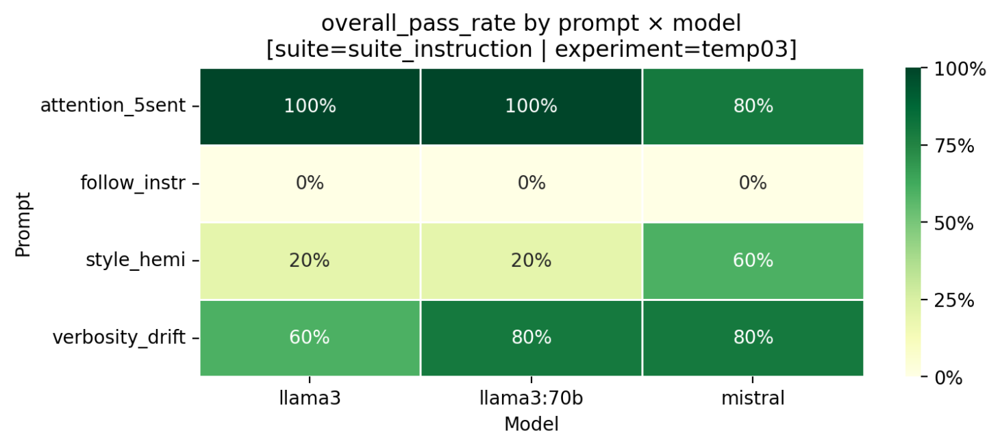
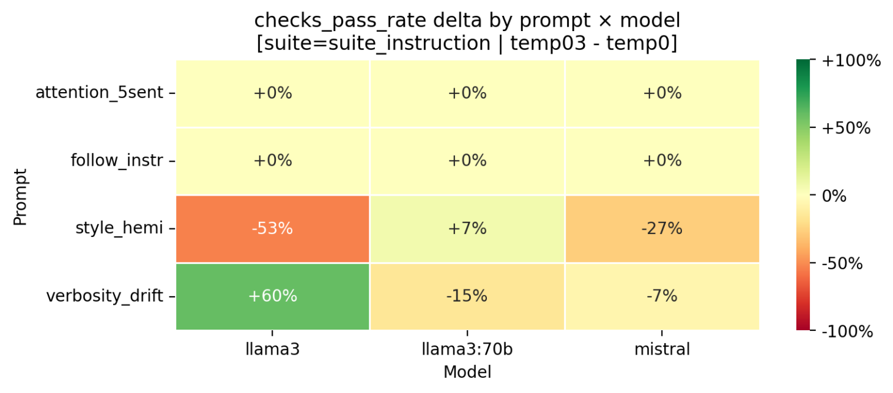

# ai-evaluation-harness

A reproducible evaluation harness for studying LLM behavior through controlled prompt suites, repeated runs, and structured interpretation — including claim extraction, narrative synthesis, and audit-based validation — designed for systematic local-model experimentation.

## v1.0 milestone

This repository’s v1.0 milestone establishes the core behavioral harness:

- modular YAML prompt suites
- reusable runner configs for controlled inference sweeps
- multi-rep runs for distributional measurement
- aggregated benchmark outputs via `runs_master`
- Streamlit dashboard analytics, including:
  - prompt × model summaries
  - pass-rate heatmaps
  - within-suite experiment comparison tables
  - signed delta heatmaps

This version focuses on **closing the loop between measurement → interpretation → validation**, enabling model behavior to be not only observed but systematically explained and audited.
Later versions extend this toward narrative generation, validation, and richer telemetry.

## v1.4 milestone

The v1.4 system extends the behavioral harness into a structured evaluation and validation pipeline:

- claim generation from benchmark deltas
- claim selection and normalization
- narrative synthesis grounded in validated claims
- strict claim-reference constraints ([CLAIMS: ...])
- narrative parsing and traceability mapping
- audit system for evaluating:
  - claim coverage
  - trace-supported vs heuristic-supported statements
  - overlap fidelity between narrative and source claims
- repair loop for improving narrative fidelity
- run-scoped experiment tracking under `benchmarks/results/runs/*`
- expanded dashboard including:
  - audit analytics
  - narrative traceability
  - claim coverage diagnostics
- explicit narrative-to-claim traceability and coverage tracking

This version focuses on **closing the loop between measurement → interpretation → validation**.

## v1.5 milestone (current)

The v1.5 system introduces structured macro evaluation and failure taxonomy:

- FRED-integrated macro prompt suite
- semantic validation via JSON-constrained tasks
- failure taxonomy (schema, semantic, symbolic, verbosity, narrative)
- semantic pattern classification (v0.3)
- experiment comparison across temperature regimes
- dashboard extensions:
  - failure taxonomy tables
  - semantic pattern distributions
  - pass-rate delta heatmaps

## Why this exists

The goal of this project is to build a practical local-model evaluation lab for measuring:

- reliability across prompt types
- behavioral drift under inference changes
- tradeoffs across constraints like structure, style, verbosity, and attention
- foundations for later interpretability / telemetry work

Temperature is treated here not just as “randomness,” but as a behavioral control knob that can shift model performance across competing dimensions.

## How this can be used

From a risk perspective, this harness can be used to map how model behavior shifts under controlled inference changes (e.g., temperature sweeps), similar to stress testing a system across different regimes. 

For example, a model that performs well on structured outputs at low temperature may degrade in instruction-following or verbosity control as temperature rises. By running repeated evaluations across prompt types and aggregating results, the harness surfaces these tradeoffs explicitly, allowing a user to identify stable operating regions and failure modes.

In practice, this can inform model selection, prompt design, and guardrail strategies by making behavioral reliability measurable, explainable, and auditable rather than anecdotal

## Repository layout

```
benchmarks/
  Core benchmark suites, runners, aggregation, and analysis helpers

dashboards/
  Streamlit dashboard for evaluation analytics

docs/
  Research notes, images, and project documentation

experiments/
  Scratch / future experimental work
```

## Quick start

1. Create the environment
```bash
conda env create -f environment.yml
conda activate ai-lab
```

2. Run a benchmark suite
From the repository root:
```bash
cd benchmarks
python run_suite.py --suite suite_instruction.yml --runner runner_temp0.yml
```

3. Aggregate outputs
```bash
python aggregate_runs.py
```
This produces the aggregated `runs_master` artifacts used by the dashboard and later analysis steps.

4. Launch the dashboard
From the repository root:
```bash
streamlit run dashboards/eval_dashboard.py
```

## Dashboard preview

### Prompt × model pass-rate heatmap
<p align="center">
  
</p>
Pass-rate heatmap across prompt × model combinations, showing constraint-specific degradation patterns across temperature sweeps.

### Within-suite experiment comparison
<p align="center">
  
</p>

## Example early findings

Across repeated temperature sweeps on the initial suites, the harness has already surfaced several stable patterns:

- some structural output constraints are largely temperature-insensitive
- some instruction-following failures appear saturated across all tested temperatures
- style and verbosity constraints can move in opposite directions as temperature rises
- some attention constraints remain stable at low temperature and degrade only at higher temperature

These are early behavioral results rather than final scientific claims, but they demonstrate that the harness can detect real tradeoff surfaces in model behavior.

## Version roadmap

- v1.0 — behavioral harness (measurement layer)
- v1.2–v1.4 — interpretation + validation layer
  - claim extraction and normalization
  - narrative generation with strict grounding constraints
  - audit system and fidelity metrics
  - repair loop for improving narrative quality
- v1.5 (next) — richer telemetry
  - token-level metrics (logprobs, latency, etc.)
  - deeper behavioral diagnostics
  - early macro / external data integration (e.g. FRED)
- v2.0 — full telemetry + analysis stack

## Notes

Generated benchmark artifacts can become large quickly. The public repository is intended to keep the core framework, selected examples, and documentation clean, while broader local result corpora remain excluded from version control unless explicitly curated.

## License

Currently unlicensed / all rights reserved unless and until a license is added.