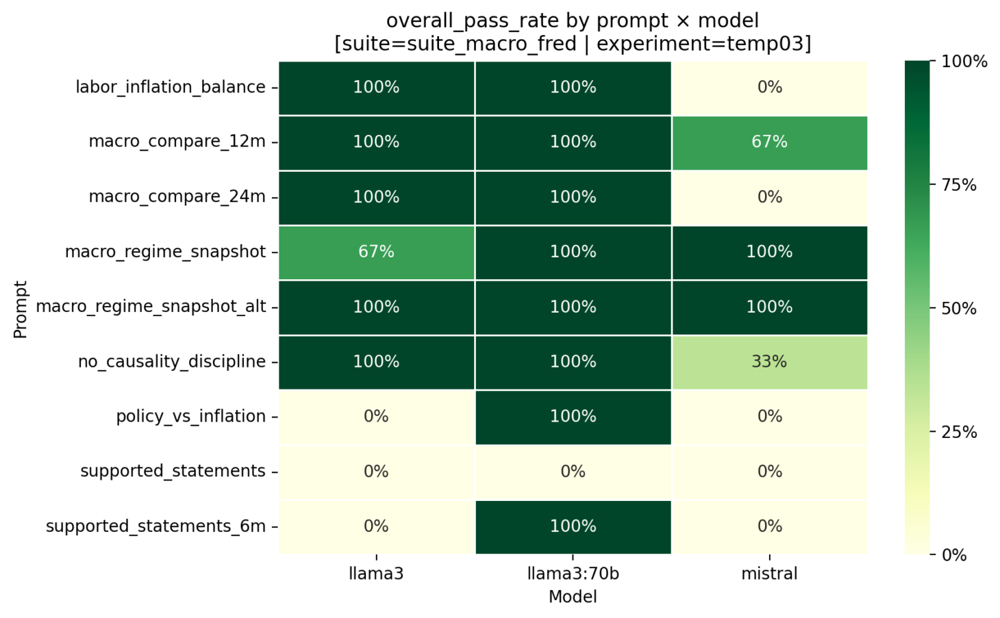
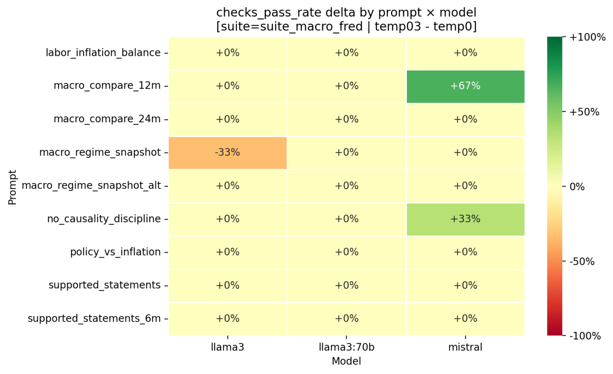

# Macro Failure Taxonomy v0.3

## Overview

This document summarizes the first structured failure taxonomy results from the macro evaluation suite introduced in v1.5.

The objective is to move beyond aggregate pass rates and instead characterize failure modes in terms of their structure, frequency, and repeatability under controlled macro reasoning tasks.

All results are based on repeated runs across:
- multiple prompt types (snapshot, comparison, structured JSON tasks)
- multiple models (mistral, llama3, llama3:70b)
- multiple inference regimes (temp0, temp0.3)

---

## Evaluation Setup

The macro suite is built using FRED-sourced data and consists of:

- snapshot-based reasoning tasks (e.g. macro_regime_snapshot)
- comparison tasks across time horizons (e.g. macro_compare_12m, macro_compare_24m)
- structured semantic tasks (e.g. policy_vs_inflation, supported_statements)
- constraint-focused prompts (e.g. no_causality_discipline)

Each task is evaluated using strict checks:
- structural constraints (JSON schema, sentence count, etc.)
- semantic constraints (exact match, tolerance thresholds)
- behavioral constraints (banned phrases, verbosity limits)

Repeated runs are aggregated into `runs_master`, enabling failure classification and pattern analysis.

---

## Failure Taxonomy (v0.3)

Failures are classified into the following categories:

- **schema_failure**
  - invalid or unparsable structured output

- **semantic_error**
  - incorrect interpretation of provided data
  - incorrect selection or comparison logic

- **symbolic_output**
  - returning expressions instead of computed values

- **verbosity_drift**
  - violating sentence or word count constraints

- **narrative_drift**
  - introducing unsupported interpretation or causal language

In addition, structured tasks include **semantic pattern classification**, capturing *how* semantic errors occur:

- `over_selection` — including unsupported items
- `under_selection` — missing supported items
- `mixed_selection_error` — combination of both
- `correct_selection` — fully correct output

---

## Empirical Findings

### 1. Failure modes are structured and repeatable

Models frequently produce identical outputs across repeated runs (identical response hashes), indicating low stochastic variance at fixed temperature.

- low stochastic variance at fixed temperature
- stable failure behavior rather than random noise

This enables deterministic classification of failure modes.

---

### 2. Structured tasks reveal systematic semantic failure patterns

In `supported_statements` tasks:

Models exhibit stable, repeatable error patterns::
  - over-selection (adding unsupported statements)
  - under-selection (missing valid statements)

These patterns are:
- consistent across runs
- model-specific (different models show different biases)

---

### 3. Freeform reasoning degrades primarily via verbosity and drift

For narrative-style tasks:

- failures are dominated by:
  - verbosity violations
  - introduction of unsupported language

Rather than incorrect facts, models tend to:
- exceed constraints
- introduce mild interpretation beyond provided data

---

### 4. Temperature introduces asymmetric tradeoffs

Comparing `temp0` vs `temp0.3`:

- some tasks improve (e.g. fluency, format adherence)
- others degrade (especially structured semantic tasks)

In particular:
- structured correctness is fragile to temperature increases
- narrative flexibility improves but at the cost of precision

---

### 5. Model differences are qualitative

Different models exhibit distinct failure behaviors:

- some models:
  - systematically over-select
- others:
  - systematically under-select

These are not random errors, but persistent behavioral tendencies.

---

## Example Results

### Pass-rate heatmap

  

Pass-rate across prompt × model combinations under baseline (temp0) conditions.

---

### Temperature comparison (temp0 vs temp0.3)

  

Change in pass rate across temperature regimes. Positive values indicate improvement at higher temperature; negative values indicate degradation.

---

## Interpretation

These results indicate that LLM behavior can be decomposed into:

- task-dependent failure regimes
- model-specific error biases
- temperature-dependent tradeoffs

Failures are not isolated events, but arise from stable behavioral patterns that persist across repeated runs and controlled inference conditions.

This structure enables:
- deterministic failure classification
- systematic comparison across models and regimes
- transition from anecdotal debugging to reproducible analysis

---

## Limitations and Next Steps

This taxonomy is an initial version and has several limitations:

- limited dataset scope (FRED macro snapshots)
- relatively small number of prompt types
- no token-level telemetry yet

Planned extensions include:

- richer telemetry (logprobs, token-level analysis)
- expanded macro scenarios
- cross-domain generalization of taxonomy
- deeper analysis of temperature effects

---

## Summary

The v0.3 macro taxonomy demonstrates that:

- model failures are structured and repeatable
- semantic errors follow identifiable patterns
- different models exhibit distinct failure biases

This work demonstrates that LLM evaluation can shift from binary success metrics to structured analysis of failure modes, providing a foundation for interpretable and controllable model behavior.